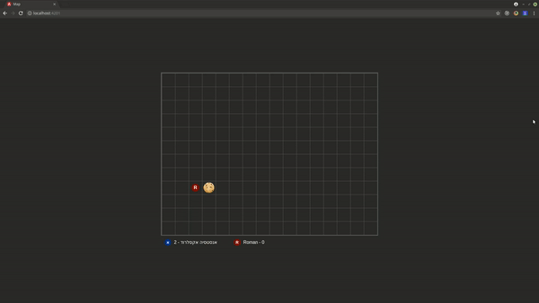

# Simple multiplayer game

This project was created for learning purpose and was presented in meetups.

[](Demo)

## Build

Before you start, make sure to copy and edit the `config.default.ts` file to `config.ts`.
Go to firebase directory, configure and deploy `Cloud functions`.

### Controller
```
ng serve --project controller
```

### Map
```
ng serve --project map --port 4201
```

-------------

Enjoy and feel free to ask me any questions!
